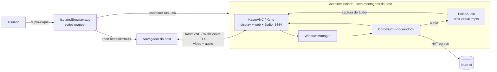

# Plano de Implementação — isolated-browser

| Campo | Valor |
|-------|-------|
| Feature | isolated-browser |
| Tipo | Feature |
| Backlog | Local (`tasks.md`) — sem board externo |
| Spec | [spec.md](spec.md) |
| Data | 2026-08-21 |

## Objetivo

Entregar um browser Chromium gráfico rodando dentro de um Apple Container isolado do filesystem do host, com sessões efêmeras e **áudio audível** (reprodução de vídeo com som), iniciado por duplo-clique em um `.app` na pasta Aplicativos do macOS.

## Visão Arquitetural



**Fluxo**: duplo-clique → `.app` inicia container `--rm` (sem `-v`) → resolve IP → aguarda porta `8444` → abre navegador do host na URL KasmVNC (HTTPS) com senha efêmera → Chromium acessível **com vídeo e áudio**. O áudio do Chromium é roteado por um PulseAudio interno (sink em tmpfs) que o KasmVNC captura e transmite ao navegador do host. Encerramento remove o container (efemeridade).

## Decisões Arquiteturais (ADRs)

| ADR | Decisão | Status |
|-----|---------|--------|
| [ADR-0001](../../architecture/decisions/0001-mecanismo-de-acesso-grafico.md) | Acesso gráfico via noVNC (Xvfb + VNC + websockify) | Superseded por ADR-0004 |
| [ADR-0002](../../architecture/decisions/0002-imagem-base-e-empacotamento-chromium.md) | Imagem Debian/Ubuntu slim + Chromium (pacotes de display atualizados para KasmVNC + PulseAudio) | Proposed |
| [ADR-0003](../../architecture/decisions/0003-estrategia-launcher-app.md) | Launcher `.app` com script wrapper gerado por script (URL/porta → KasmVNC HTTPS :8444) | Proposed |
| [ADR-0004](../../architecture/decisions/0004-audio-e-acesso-grafico-via-kasmvnc.md) | Áudio + acesso gráfico via KasmVNC + PulseAudio (porta 8444/HTTPS) | Accepted |

## Estrutura de Repositório Proposta

```
container/
  Dockerfile          # imagem: Chromium + KasmVNC + PulseAudio (ADR-0002 + ADR-0004)
  entrypoint.sh       # orquestra PulseAudio -> KasmVNC -> WM -> Chromium
app/
  launch.sh           # script wrapper do .app (start -> IP -> poll -> open -> cleanup)
  Info.plist          # template do bundle
  build-app.sh        # gera dist/IsolatedBrowser.app (ADR-0003)
Makefile              # atalhos de build/run/app/lint/clean
README.md             # pré-requisitos, primeira execução (Gatekeeper + cert autoassinado), uso
tasks.md              # backlog local
docs/                 # spec, ADRs, plano
```

## Mapeamento Requisito → Componente

| Requisito | Componente | Como é atendido |
|-----------|-----------|-----------------|
| RF-001 | `container/Dockerfile` | Chromium empacotado na imagem |
| RF-002 | `entrypoint.sh` (KasmVNC) | Acesso gráfico web via KasmVNC (ADR-0004) |
| RF-003 / INV-001 | `app/launch.sh` (`run` sem `-v`) | Nenhuma montagem do host (áudio via tmpfs) |
| RF-004 / RNF-002 | `app/launch.sh` | Ausência de `-v`/volumes |
| RF-005 / INV-002 | `--rm` + tmpfs interno + senha efêmera | Estado zero por sessão |
| RF-006 | Rede NAT padrão do container | Egresso direto sem config |
| RF-007 / RF-008 | `app/build-app.sh` + `launch.sh` | `.app` de duplo-clique com auto-open |
| RF-009 | `entrypoint.sh` (PulseAudio → KasmVNC) | Áudio do Chromium roteado ao host (ADR-0004) |
| RF-010 | KasmVNC (vídeo + áudio no mesmo stream) | Reprodução A/V utilizável e sincronizada |

## Considerações de Segurança

- Porta KasmVNC (`8444`, HTTPS) **não** publicada em LAN/loopback via `--publish`; acesso só pelo IP host-local do container.
- **Senha KasmVNC efêmera por sessão** (gerada no `launch.sh`, injetada por env/tmpfs); nunca fixa, logada ou persistida.
- **Áudio via PulseAudio interno em tmpfs**: nenhum dispositivo/socket de áudio do host é montado (INV-001 preservado).
- **TLS autoassinado por sessão** (KasmVNC): certificado gerado em tmpfs; aviso de certificado na primeira conexão — documentar no README (análogo ao Gatekeeper).
- Chromium com `--no-sandbox` justificado pelo isolamento container/VM (ADR-0002).
- Trigger de segurança presente (exposição de porta de display/áudio + egresso de rede), porém host-local e efêmero. **Recomendação**: revisão de segurança arquitetural leve (`devsquad.security`) antes de finalizar; não bloqueante para o formato fast-dev.

## Práticas de Engenharia

| Prática | Decisão | Referência |
|---------|---------|------------|
| Estratégia de branch | Trunk-based simples (projeto pessoal/fast-dev) | Definido pela equipe |
| CI/CD | Sem pipeline externo nesta fase; validação local | Definido pela equipe |
| Code Review | Autorreview + checagem local antes do commit | Definido pela equipe |
| Observabilidade | Logs do entrypoint no stdout do container | Definido pela equipe |
| IaC | N/A (sem infraestrutura em nuvem) | Definido pela equipe |
| Lint | `shellcheck` (scripts) + `hadolint` (Dockerfile) | Definido pela equipe |

## Commands

Comandos executáveis para este projeto (copie e execute diretamente):

### Build

```
container build -t isolated-browser:latest ./container
```

### Tests

```
# Smoke test manual (sem framework): valida boot e disponibilidade da porta KasmVNC
./app/launch.sh --smoke   # [TBD: flag a implementar; verifica start + porta 8444 + cleanup]
```

### Lint/Formatting

```
shellcheck app/launch.sh app/build-app.sh container/entrypoint.sh
hadolint container/Dockerfile
```

### Local Execution

```
container run --rm -d --name isolated-browser isolated-browser:latest
# gerar/instalar o .app:
./app/build-app.sh && cp -R dist/IsolatedBrowser.app /Applications/
```

## Fases de Implementação (para tasks.md)

1. **Imagem base + Chromium** (ADR-0002): `Dockerfile` mínimo que builda e roda Chromium. ✔ concluída.
2. **Stack de display + áudio KasmVNC** (ADR-0004): substituir Xvfb/x11vnc/websockify/noVNC por KasmVNC; adicionar PulseAudio; validar acesso gráfico **com áudio** via IP do container (HTTPS :8444).
3. **Entrypoint orquestrador**: `entrypoint.sh` sobe PulseAudio → KasmVNC → WM → Chromium; senha KasmVNC efêmera; roteamento de áudio do Chromium para o sink PulseAudio.
4. **Launcher `.app`** (ADR-0003): `launch.sh` (start → IP → poll 8444 → open `https://IP:8444` → cleanup) + `Info.plist` + `build-app.sh`.
5. **Efemeridade e isolamento**: garantir `--rm`, ausência de `-v`, tmpfs (incl. estado do PulseAudio); verificar CC-002/CC-003.
6. **Hardening + docs**: senha efêmera, README (Gatekeeper + cert autoassinado/pré-requisitos), lint (shellcheck/hadolint).
7. **Verificação de conformidade**: validar CC-001..CC-005 manualmente (incl. áudio).

## Critérios de Conformidade (rastreabilidade)

| CC | Validação | Fase |
|----|-----------|------|
| CC-001 | Duplo-clique abre container + UI gráfica | 4, 7 |
| CC-002 | Reinício sem dados da sessão anterior | 5, 7 |
| CC-003 | Nenhum caminho do host acessível no container | 5, 7 |
| CC-004 | Página pública carrega via NAT | 2, 7 |
| CC-005 | Vídeo público reproduz com áudio audível/sincronizado | 2, 3, 7 |

## Pendências / A confirmar na implementação

- Forma exata de resolução do IP do container no CLI instalado (`container inspect`/`ls`). **Confirmado no tracer**: ambos funcionam; `container ls` expõe campo `IP` e `container inspect` retorna o IP como primeiro endereço.
- Nome dos pacotes na distro base: Chromium (`chromium` no Debian, confirmado), `kasmvnc`/`kasmvncserver`, `pulseaudio`.
- Modo de habilitar o streaming de áudio do KasmVNC e roteamento do Chromium para o sink PulseAudio (env/config).
- Suporte (ou não) a `--publish` no Apple Container instalado — o design não depende disso, usa IP direto.
- Aceitação do certificado autoassinado do KasmVNC no primeiro acesso (documentar); avaliar TLS off host-local se o atrito for alto.
