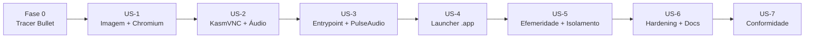

# Backlog de Tarefas — isolated-browser

| Campo | Valor |
|-------|-------|
| Feature | isolated-browser |
| Tipo | Feature |
| Backlog | Local (`tasks.md`) — sem board externo |
| Spec | [spec.md](spec.md) |
| Plano | [plan.md](plan.md) |
| Data | 2026-08-21 |

## Legenda

- `[ ]` pendente · `[x]` concluído
- `[P]` paralelizável (sem dependência com tarefas do mesmo bloco)
- IDs entre parênteses rastreiam para `spec.md` (RF/RNF/CS/CC/INV) e ADRs.

## ADRs de Referência

| ADR | Decisão | Status |
|-----|---------|--------|
| [ADR-0001](../../architecture/decisions/0001-mecanismo-de-acesso-grafico.md) | Acesso gráfico via noVNC (Xvfb + VNC + websockify) | Superseded por ADR-0004 |
| [ADR-0002](../../architecture/decisions/0002-imagem-base-e-empacotamento-chromium.md) | Imagem Debian slim + Chromium via apt | Superseded por ADR-0005 (Neko traz a própria base) |
| [ADR-0003](../../architecture/decisions/0003-estrategia-launcher-app.md) | Launcher `.app` (realizado como app nativo WKWebView) | Accepted |
| [ADR-0004](../../architecture/decisions/0004-audio-e-acesso-grafico-via-kasmvnc.md) | Áudio + acesso gráfico via KasmVNC + PulseAudio | Superseded por ADR-0005 |
| [ADR-0005](../../architecture/decisions/0005-acesso-grafico-e-audio-via-webrtc-neko.md) | Acesso gráfico + áudio via WebRTC (Neko) | Accepted |

Histórico: noVNC (ADR-0001) → KasmVNC (ADR-0004, sem servidor de áudio no `.deb`) → **Neko/WebRTC (ADR-0005)**, que entrega vídeo+áudio nativos.

---

## Fase 0 — Tracer Bullet (fatia fim-a-fim mínima)

**Objetivo**: provar o caminho crítico completo com o menor esforço possível — container sobe, Chromium renderiza e é visível no host. Valida a arquitetura antes de investir nas fases seguintes.

- [x] Criar `container/Dockerfile` mínimo (base slim + Chromium + Xvfb + x11vnc + websockify/noVNC) que sobe Chromium sob Xvfb e expõe noVNC na porta 6080 com senha fixa temporária de teste (RF-001, RF-002)
- [x] Criar `container/entrypoint.sh` esqueleto (Xvfb → Chromium → x11vnc → websockify) hardcoded, apenas para o tracer (RF-002)
- [x] Validar manualmente: `container build` + `container run --rm` + resolver IP + abrir `http://IP:6080` no host e ver o Chromium (CC-001, CC-004)

**Aceitação Fase 0**: a partir de um `run`, uma página pública carrega dentro do Chromium visível no navegador do host (CC-004). Senha fixa é aceitável aqui.

> **Nota (2026-08-21):** A validação visual do tracer confirmou vídeo mas **sem áudio** (noVNC/RFB não transporta som). Isso motivou a **ADR-0004** (KasmVNC + PulseAudio), que **supersede a ADR-0001**. A partir da US-2, o stack noVNC é substituído por KasmVNC + áudio. A Fase 0 permanece concluída como registro do caminho fim-a-fim.

---

## US-1 — Imagem base + Chromium (Fase 1)

**Como** desenvolvedor, **quero** uma imagem de container que empacote e execute Chromium, **para** ter a base gráfica do browser isolado. (ADR-0002, RF-001)

- [x] Definir base slim e fixar tag da imagem em `container/Dockerfile` (ADR-0002)
- [x] Instalar Chromium e dependências X mínimas via apt em `container/Dockerfile`; confirmar nome exato do pacote Chromium na distro (pendência do plano) (RF-001, ADR-0002)
- [x] Configurar Chromium para rodar com `--no-sandbox` em `container/Dockerfile`/`entrypoint.sh` (ADR-0002)
- [x] [P] Reduzir camadas/limpeza de apt para build enxuto e rápido em `container/Dockerfile` (RNF-001)

**Dependências**: Fase 0.
**Aceitação US-1**: `container build -t isolated-browser:latest ./container` sucede e Chromium inicia sem crash (RF-001).

---

## US-2 — Stack de display + áudio via Neko/WebRTC (Fase 2)

**Como** usuário, **quero** acessar graficamente o browser via IP do container **com áudio**, **para** interagir com o Chromium isolado e ouvir vídeos como no browser principal do SO. (ADR-0005, RF-002, RF-009, RF-010)

> Nota: a rota KasmVNC (ADR-0004) foi abandonada — o `.deb` standalone não traz servidor de áudio. Adotado **Neko** (imagem `ghcr.io/m1k1o/neko/chromium`), que entrega vídeo+áudio nativos por WebRTC.

- [x] Adotar a imagem Neko (Chromium) arm64; `container image pull` (ADR-0005)
- [x] Configurar `NEKO_SERVER_BIND=0.0.0.0:8080` para acesso host-local (RF-002)
- [x] Configurar WebRTC: `NEKO_EPR` (faixa UDP) + ICE com candidato host (rede plana do Apple Container) (ADR-0005)
- [x] Áudio nativo: Neko captura o `audio_output.monitor` do PulseAudio interno e streama por WebRTC (RF-009, RF-010)
- [x] Validar vídeo + áudio + controle navegando em página pública/vídeo (CC-004, CC-005)

**Dependências**: US-1.
**Aceitação US-2**: página/vídeo carrega e é navegável via cliente Neko no host (`http://IP:8080`), **com áudio audível** (CC-004, CC-005, RF-002, RF-009).

---

## US-3 — Configuração de sessão do Neko (Fase 3)

**Como** operador do container, **quero** que a sessão suba pronta para uso (usuário único com controle, sem atrito de login), **para** navegar com vídeo e som sem passos manuais. (RF-002, RF-005, RF-009, RF-010, INV-002)

- [x] `NEKO_SESSION_IMPLICIT_HOSTING=true` para assumir o controle automaticamente ao interagir (RF-002)
- [x] Perfil de usuário como admin (`NEKO_MEMBER_MULTIUSER_USER_PROFILE={"is_admin":true}`) para ter controle (RF-002)
- [x] `NEKO_SESSION_COOKIE_SECURE=false` (acesso HTTP host-local) (RF-002)
- [x] Estado 100% efêmero: `container run --rm`, sem `-v`; nada persiste entre sessões (RF-005, INV-002)
- [x] Auto-login + `embed=1` via query params na URL do cliente (RF-008)
- [x] Validar áudio: reproduzir vídeo e confirmar playback audível no host (RF-009, RF-010, CC-005)

**Dependências**: US-2.
**Aceitação US-3**: `container run` sobe a sessão pronta; o usuário controla e um vídeo reproduz **com áudio audível** no host, sem etapa de login manual (RF-005, RF-009, RF-010, INV-002, CC-005).

---

## US-4 — Launcher `.app` nativo de duplo-clique (Fase 4)

**Como** usuário macOS, **quero** iniciar o browser isolado com duplo-clique num ícone nos Aplicativos, **para** navegar sem passos manuais de terminal. (ADR-0003, ADR-0005, RF-007, RF-008, CS-001)

> Realizado como **app nativo (Swift + WKWebView)** em vez de script wrapper: dá identidade própria (nome/ícone), janela maximizada sem fullscreen do macOS, WebView privado e **teardown do container ao fechar** — o Chrome não encerrava ao fechar a janela.

- [x] `app/IsolatedBrowser.swift`: sobe o container Neko `--rm` (sem `-v`) → resolve IP → aguarda a porta → carrega `http://IP:8080/?usr=neko&pwd=neko&embed=1` num WKWebView non-persistent (RF-007, RF-008, INV-001)
- [x] Teardown: `applicationWillTerminate` mata/remove o container; fechar a janela encerra o app (RF-005, INV-002)
- [x] `app/Info.plist` (nome "Isolated Browser", identifier, ícone) (ADR-0003, RF-007)
- [x] `app/make-icon.swift` + `app/build-app.sh` geram `dist/IsolatedBrowser.app` (compila Swift, ícone, assina ad-hoc) (ADR-0003, RF-007)
- [x] `Makefile` com alvos `pull`, `app`, `install`, `run`, `stop`, `open`, `clean` (RNF-001)
- [x] Validar: abrir o `.app` → container sobe, janela maximizada com vídeo+áudio; fechar → container removido (CC-001, CS-001, INV-002)

**Dependências**: US-3.
**Aceitação US-4**: abrir o `.app` abre o container e a janela do browser (via `http://IP:8080`) sem terminal; fechar a janela remove o container (CC-001, RF-008, INV-002).

---

## US-5 — Efemeridade e isolamento (Fase 5)

**Como** usuário preocupado com segurança, **quero** que cada sessão seja descartável e sem acesso ao host, **para** proteger meus arquivos e não deixar rastros. (RF-003, RF-004, RF-005, RNF-002, INV-001, INV-002)

- [ ] Garantir `run --rm` e ausência total de `-v`/montagens em `app/launch.sh` (RF-004, RNF-002, INV-001)
- [ ] Usar tmpfs para dados voláteis do browser e estado do PulseAudio dentro do container (RF-005, INV-001, INV-002)
- [ ] Verificar CC-003 (negativo): tentar acessar caminho do host (ex.: `/Users/...`) de dentro do container e confirmar indisponibilidade (CC-003, RF-003, INV-001)
- [ ] Verificar CC-002: reiniciar sessão com cookies/downloads e confirmar estado zero na nova sessão (CC-002, RF-005, INV-002)

**Dependências**: US-4.
**Aceitação US-5**: nenhum caminho do host é acessível no container (CC-003) e nova sessão inicia sem dados da anterior (CC-002).

---

## US-6 — Hardening + documentação (Fase 6)

**Como** mantenedor, **quero** endurecer credenciais e documentar pré-requisitos, **para** entregar o projeto com segurança e onboarding claros. (Segurança do plano, RNF-001)

- [ ] Remover qualquer senha fixa de teste; confirmar senha KasmVNC 100% efêmera por sessão em `entrypoint.sh`/`launch.sh` (RF-005, INV-002)
- [ ] Confirmar que a porta KasmVNC (8444) não é publicada em LAN/loopback via `--publish`; acesso apenas pelo IP host-local (Segurança do plano)
- [ ] Escrever `README.md`: pré-requisitos, primeira execução (Gatekeeper do `.app` **e** aceitação do certificado autoassinado do KasmVNC), instalação do `.app`, uso e limitações de escopo
- [ ] [P] Rodar e corrigir `shellcheck app/launch.sh app/build-app.sh container/entrypoint.sh`
- [ ] [P] Rodar e corrigir `hadolint container/Dockerfile`
- [ ] [P] (Recomendado) Executar revisão de segurança arquitetural leve antes de finalizar (Segurança do plano)

**Dependências**: US-5.
**Aceitação US-6**: sem credenciais fixas; lint sem erros; README permite a um novo usuário instalar e abrir o `.app` (RNF-001).

---

## US-7 — Verificação de conformidade (Fase 7)

**Como** responsável pela qualidade, **quero** validar todos os critérios de conformidade, **para** confirmar que a feature atende à spec. (CC-001..CC-005, CS-001..CS-005)

- [ ] Validar CC-001: duplo-clique no `.app` inicia container e abre UI gráfica (CC-001, CS-001)
- [ ] Validar CC-002: reinício sem dados da sessão anterior (CC-002, CS-002)
- [ ] Validar CC-003: nenhum arquivo do host legível/gravável a partir do container (CC-003, CS-003)
- [ ] Validar CC-004: página pública carrega via NAT do container (CC-004, CS-004)
- [ ] Validar CC-005: abrir um vídeo público (ex.: YouTube) e confirmar áudio audível e sincronizado (CC-005, CS-005, RF-009, RF-010)
- [ ] Registrar resultados da verificação (pass/fail por CC) no `README.md` ou em nota de verificação

**Dependências**: US-6.
**Aceitação US-7**: CC-001, CC-002, CC-003, CC-004 e CC-005 todos aprovados.

---

## Sequência de Implementação Sugerida

1. **Fase 0 (Tracer Bullet)** — provou o caminho fim-a-fim; revelou a lacuna de áudio (→ ADR-0004).
2. **US-1 → US-2 → US-3** — consolidam a imagem, o display+áudio KasmVNC e o entrypoint com PulseAudio e senha efêmera.
3. **US-4** — entrega o launcher `.app` de duplo-clique (marco de UX: CS-001).
4. **US-5** — trava efemeridade e isolamento (marco de segurança: CC-002, CC-003).
5. **US-6** — hardening final e documentação.
6. **US-7** — verificação manual de conformidade, incluindo áudio (gate de release: CC-005).

Tarefas marcadas `[P]` dentro de um mesmo bloco podem avançar em paralelo. Os testes são parte da aceitação de cada tarefa (validação manual/smoke, sem tarefas de teste separadas).

## Rastreabilidade Requisito → Fase

| ID | Onde é atendido |
|----|-----------------|
| RF-001 | Fase 0, US-1 |
| RF-002 | Fase 0, US-2, US-3 |
| RF-003 / INV-001 | US-5 |
| RF-004 / RNF-002 | US-5 |
| RF-005 / INV-002 | US-3, US-4, US-5 |
| RF-006 | US-2 (NAT), US-7 (CC-004) |
| RF-007 / RF-008 | US-4 |
| RF-009 | US-2, US-3, US-7 |
| RF-010 | US-2, US-3, US-7 |
| RNF-001 | US-1, US-4, US-6 |
| CC-001 | Fase 0, US-4, US-7 |
| CC-002 | US-5, US-7 |
| CC-003 | US-5, US-7 |
| CC-004 | Fase 0, US-2, US-7 |
| CC-005 | US-2, US-3, US-7 |
